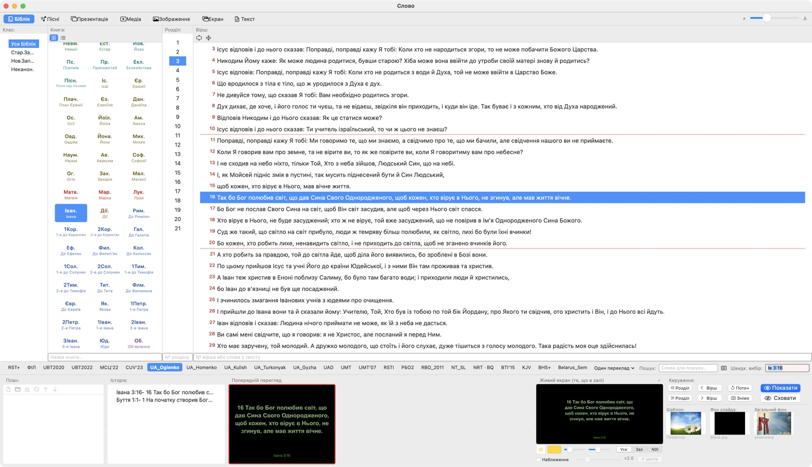
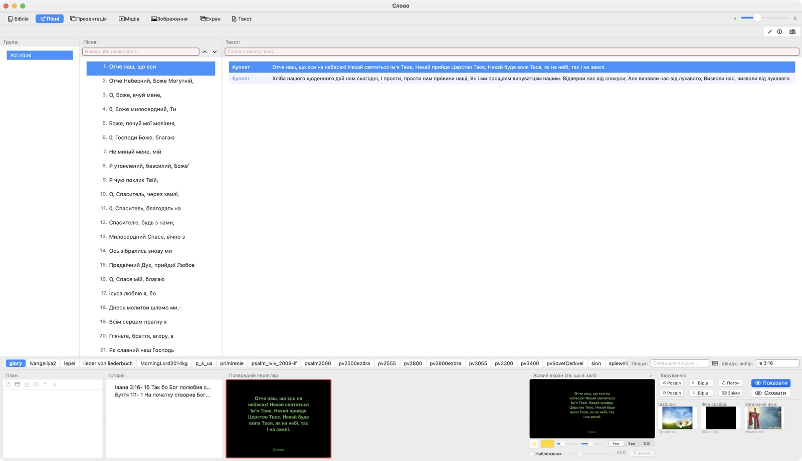
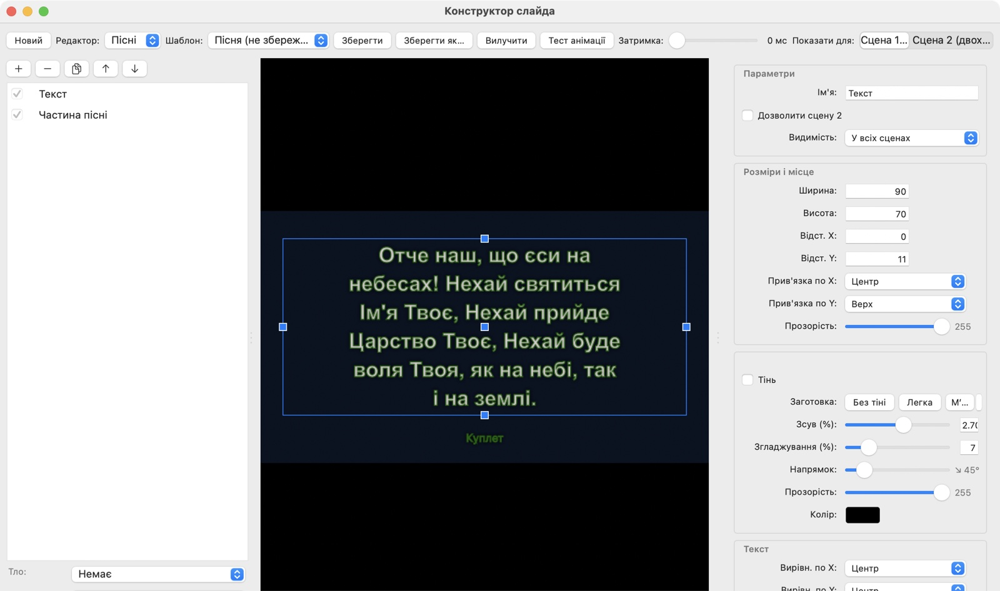
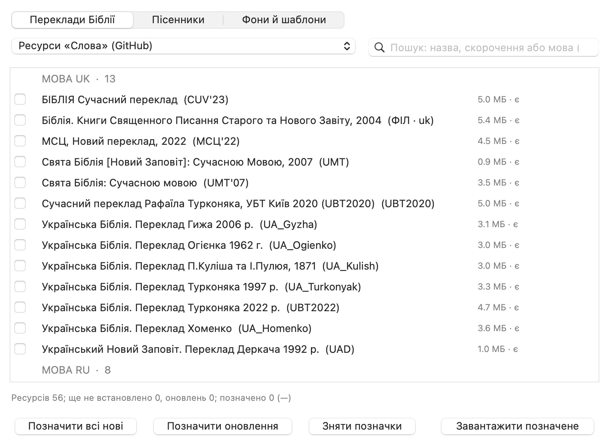
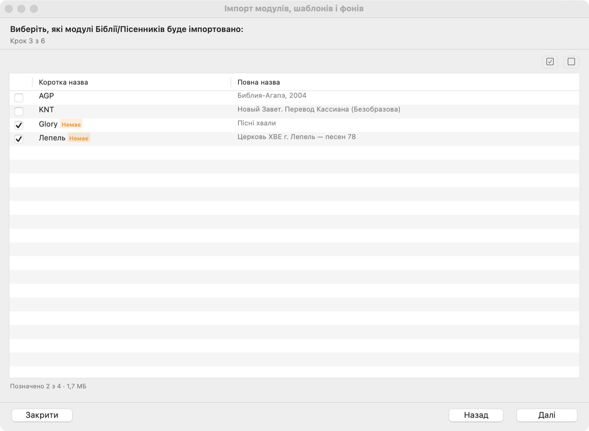
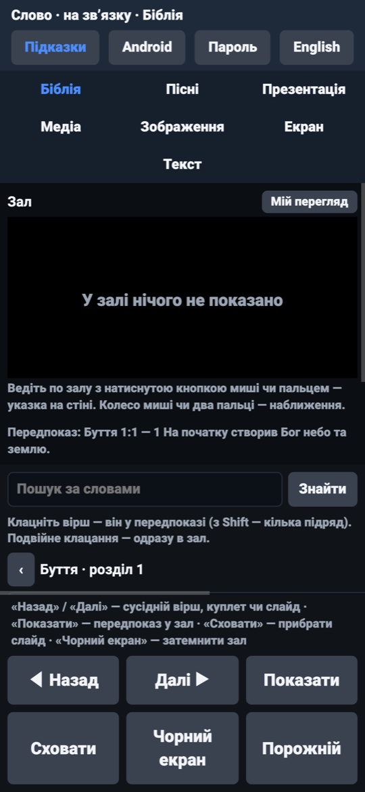
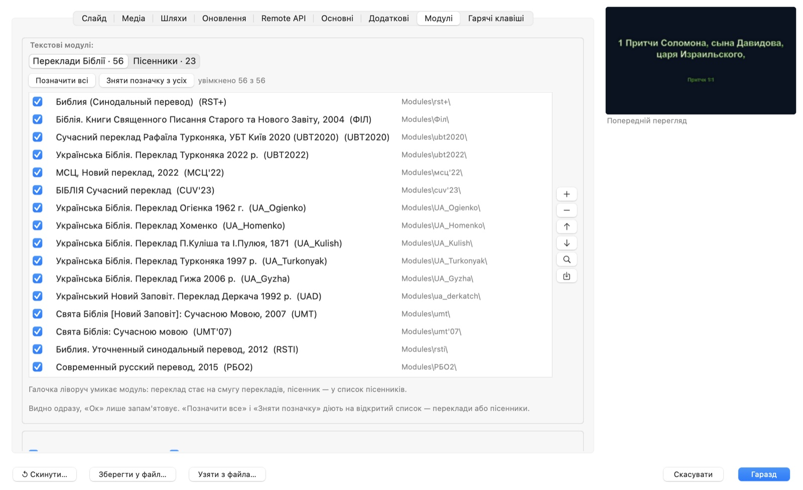

# Слово

[Українська](#слово) · [English](#english)

**Слово** — програма для macOS, щоб показувати на проекторі під час
богослужіння Біблію, пісні, презентації, зображення, відео й оголошення.
До неї є пульт на телефоні, робоче місце оператора на планшеті й пульт у
браузері будь-якого пристрою в мережі.



Інтерфейс і порядок роботи натхненні програмою
[VisioBible](https://visiobible.org.ua). «Слово» написане з нуля: воно не
містить коду VisioBible і не пов'язане з її авторами.

**Завантажити:** [останній випуск](../../releases/latest) — програма для
macOS (Intel і Apple Silicon) і дві програми для Android.

| Коротко | |
| --- | --- |
| Мови інтерфейсу | українська, English, русский, Deutsch — за мовою системи (для інших мов — англійська); у пульті, веб-пульті й планшеті — українська й англійська з перемикачем |
| Переклади з інтернету | ресурси «Слова», «Цитата з Біблії» (GitHub), реєстр MyBible (~2800), eBible.org (~1300 вільних перекладів понад тисячею мов) |
| Пісенники з інтернету | ресурси «Слова», SoftProjector (українські, російські, англійські, чеські, словацькі, німецькі) |
| Імпорт своїх даних | VisioBible, «Цитата з Біблії» (тека чи `.zip`), MyBible `.SQLite3`, MySword `.bbl.mybible`, пісенники `.vbm`, `.songbook`, `.sps`, `.txt`; шаблони `.sch`; фони; PDF і PowerPoint |
| Виводи | проектор, NDI, веб-сторінки для OBS; пульт на Android, планшет оператора, пульт у браузері |
| Сумісність із VisioBible | той самий порядок роботи й гарячі клавіші; модулі, пісенники `.vbm`, шаблони `.sch`, файли перекладу `.lng`, налаштування й Remote API — [докладно](#сумісність-із-visiobible) |
| Довідка | у самій програмі, українською й англійською, без інтернету; [як запустити на Mac](Документація/ЗАПУСК.md) — усі помилки й дозволи |

## Як це працює

Оператор вибирає вірш, куплет, слайд чи картинку — вони з'являються в
**передпоказі**. Подвійне клацання, Enter або кнопка **«Показати»** виводить
їх у зал, і **живий екран** у вікні показує рівно те, що бачать люди. У
**Плані** — порядок служіння, в **Історії** — усе, що вже показували.

## Біблія

- Десятки перекладів: українські (Огієнко, Хоменко, Куліш, Турконяк, УБТ,
  Гижа, МСЦ'22 та інші), російські, англійські, білоруські, казахські,
  киргизькі, узбецькі.
- Книги значками, списком або таблицею; класи «Старий Заповіт», «Новий
  Заповіт», неканонічні книги.
- Кілька перекладів на одному слайді; звірка нумерації віршів між
  перекладами.
- Швидкий вибір адресою («Ів 3:16»), номером вірша або словами з тексту;
  пошук за словами по всьому перекладу.
- Довгий вірш сам ділиться на сторінки; стрілки гортають вірші й розділи.

## Пісні



- Пісенники з групами, пошук за номером, назвою чи словами з тексту.
- Частини пісні — куплет, приспів, міст — зі своїми кольорами.
- Редактор пісень і пісенників; імпорт пісенників VisioBible (`.vbm`), свій
  формат `.songbook`.

## Презентації, зображення, медіа, екран, текст

- **Презентації** — PDF і PowerPoint, мініатюри сторінок, переходи.
- **Зображення** — показ і слайд-шоу з інтервалом.
- **Медіа** — відео, звук, мережеві потоки, YouTube.
- **Фонограми (мінусовки)** — окремий плеєр зі своїм списком, що грає під
  показом: хвиля всього треку з курсором (клацання — грати з цього місця),
  індикатор рівня, пауза, «по колу», «після кінця — наступна», тон ±0,5
  (півтону) без зміни темпу — запам'ятовується для кожного файлу.
- **Екран** — монітор або вікно іншої програми на проекторі.
- **Текст** — оголошення із заголовком.

## Конструктор слайдів



Окремі редактори для Біблії та для пісень: шрифти, кольори, тіні, контур,
поля, фон, розміщення тексту. Зміни видно одразу на прикладі слайда.

## Переклади, пісенники й фони з інтернету



- Вкладки «Переклади Біблії», «Пісенники», «Фони й шаблони» — у кожної свої
  джерела:
  - переклади — ресурси «Слова»
    ([slovo-resources](https://github.com/roman885-85/slovo-resources)),
    модулі «Цитата з Біблії» на GitHub, реєстр [MyBible](https://mybible.zone)
    (~2800 перекладів) і [eBible.org](https://ebible.org) (~1300 вільних
    перекладів понад тисячею мов — ставляться модулем MyBible);
  - пісенники — ресурси «Слова» і [SoftProjector](https://softprojector.org)
    (українські, російські, англійські, чеські, словацькі, німецькі);
  - фони, шаблони, шрифти й веб-сторінки — ресурси «Слова».
- Пошук за назвою, скороченням або кодом мови («uk», «ru», «en»); позначити
  всі нові або лише оновлення.
- **Імпорт** своїх даних: тека VisioBible, модулі «Цитата з Біблії» (зокрема
  zip-архіви), MyBible `.SQLite3`, пісенники `.vbm` і `.songbook`, шаблони й
  фони.



### Формати, які програма відкриває й імпортує

| Що | Формати |
| --- | --- |
| Переклади Біблії | «Цитата з Біблії» (BibleQuote) — тека з `bibleqt.ini` або архів `.zip` (і кілька архівів у теці); MyBible — `.SQLite3`, `.sqlite` (словники й коментарі поруч переносяться разом); MySword — `.bbl.mybible`; тека з даними VisioBible; з вікна ресурсів — VPL eBible.org (перетворюється на MyBible) |
| Пісенники | VisioBible — `.vbm` (перетворюється на свій формат); «Слово» — `.songbook`; SoftProjector — `.sps` усіх версій (база SQLite, XML і найстаріший текст 1.x); модуль-пісенник «Цитата з Біблії» (`bibleqt.ini`); текстовий файл `.txt` |
| Шаблони слайда | тека `Templates` із файлами `.sch` і їхніми картинками |
| Фони й зображення | `.jpg`, `.jpeg`, `.png`, `.bmp`, `.gif`, `.tif`, `.tiff`, `.heic`, `.webp` |
| Презентації | `.pdf`, `.pptx`, `.ppsx`, `.potx`, `.pptm`, `.ppsm` |
| Відео й звук | поширені формати (`.mp4`, `.mov`, `.m4v`, `.mp3`, `.m4a`, `.wav`, `.aac`, `.flac` та ін.), мережеві потоки, YouTube |
| Налаштування | файл налаштувань «Слова» (`.json`, «Зберегти у файл…» / «Узяти з файла…») |
| План проповіді на планшеті | переклади `.zip` («Цитата з Біблії»), `.SQLite3` (MyBible), пісенники `.vbm`; файли PDF, PowerPoint, картинки, відео |

Підказку з форматами показують сам майстер імпорту, вікна вибору файлів і
пункти меню імпорту пісенника.

## Виводи

- **Проектор** — окремий екран; на одному моніторі — вікно слайда.
- **NDI** для трансляції (OBS, vMix) — вбудовано.
- **Веб-сторінки** для OBS і моніторів у фоє.
- **Указка й наближення** — мишею, трекпадом чи з пульта.

## Пульт, планшет і браузер



- **Пульт на телефоні** (Android 6 і новіші) — гортати, указка.
- **Планшет оператора** (Android 5 і новіші) — усі вкладки програми, зал,
  План та Історія.
- **Пульт у браузері** будь-якого пристрою — адреса `slovo.local`.
- **План проповіді**: проповідник складає його на планшеті вдома, без
  зв'язку, а на служінні однією кнопкою робить головним планом «Слова».
- Програми для Android ставляться за QR-кодом із меню «Налаштування» →
  «Програми для Android…».

## Налаштування й оновлення



- Мови інтерфейсу — українська, російська, англійська, німецька. За
  умовчанням — мова системи: українська чи російська, а для будь-якої іншої —
  англійська. Пульт, веб-пульт і планшет теж мають англійську з перемикачем.
- Модулі перекладів і пісенників окремо, гарячі клавіші, монітори, шляхи.
- Програма сама перевіряє оновлення і ставить нову версію, показуючи хід
  оновлення; переклади й дані лишаються на місці.
- **Довідка** в самій програмі (меню «Довідка», ⌘?) — українською й
  англійською, без інтернету: кожна вкладка, гарячі клавіші, «Якщо щось не
  так». До кнопок і налаштувань — спливні підказки.

## Сумісність із VisioBible

«Слово» повторює VisioBible не лише виглядом, а й порядком роботи та
форматами даних: хто працював у VisioBible, знаходить усе на звичних місцях,
а його переклади, пісенники й шаблони переходять без ручного перетворення.

| Що | Як у «Слові» |
| --- | --- |
| Вікно й порядок роботи | ті самі частини вікна — вкладки режимів, План, Історія, передпоказ, «Керування» з шаблоном і фонами; ті самі меню; одне клацання — передпоказ, подвійне, Enter чи F5 — у зал; одна пара стрілок гортає передпоказ, друга — зал |
| Гарячі клавіші | набори «VB Version 2.2», «2.3» і «2.4»: F5 — показати, Esc — сховати, F2 — План, F3 — пошук, F4 і F7–F9 — швидкий вибір, F11 — знімок, F12 — затемнення, Ctrl+F5 — порожній слайд та інші; файл `hotkeys.ini` того самого вигляду |
| Переклади Біблії | модулі «Цитата з Біблії» (BibleQuote), якими користується VisioBible, — теки з `bibleqt.ini` і `.zip`; редактор невідповідностей нумерації перекладів |
| Пісенники | читає й записує пісенники VisioBible `.vbm`; редактор пісень; кольори частин пісні (куплет, приспів, міст) і альтернативні назви частин |
| Шаблони й фони | шаблони слайда `.sch` із теки `Templates` разом із мініатюрами й фонами; фони з `BackGrounds` |
| Імпорт | майстер імпорту бере теку з даними VisioBible цілком: модулі, пісенники, шаблони, фони |
| Налаштування | `Slovo.ini` — ті самі секції й ключі, що в налаштуваннях VisioBible (слайд, адреса місця Писання, назва пісні, медіа, NDI, Remote API, монітор); вікно «Параметри» з тими самими вкладками |
| Переклад інтерфейсу | файли перекладу VisioBible `Language/*.lng` і вікно «Переклад інтерфейсу» для їх правки; власні підписи «Слова» — у тому ж файлі окремою секцією |
| Remote API | протокол VisioBible для сторінок і пристроїв — WebSocket, TCP (8101) і UDP (8100) з тими самими командами й пакетами; сторінки з теки `RemoteAPI` (титри для OBS, монітори у фоє) під'єднуються без змін |
| NDI | трансляція слайда з прозорим фоном і тими самими режимами частоти кадрів |

Не переносяться теми оформлення VCL (`.vsf`) і довідка `.chm` — вони існують
лише для Windows; налаштування іншої програми майстер імпорту не переносить.
Сумісність зроблено за файлами даних і описом VisioBible; «Слово» не містить
її коду й не пов'язане з її авторами.

## Перший запуск

1. Завантажте `Slovo-<версія>-macOS.zip` з [Releases](../../releases),
   розпакуйте й перенесіть «Слово.app» куди зручно.
2. Програма підписана тимчасовим підписом, тож перший запуск — так: на
   macOS 11–14 правою кнопкою на «Слово.app» → «Відкрити» → «Відкрити»; на
   macOS 15 і новіших — спробуйте відкрити, потім «Системні параметри» →
   «Приватність і безпека» → «Все одно відкрити». Покроково, з усіма
   помилками й дозволами, які просить macOS, — **[як запустити на
   Mac](Документація/ЗАПУСК.md)**.
3. На першому запуску програма запропонує завантажити переклади, пісенники,
   фони й шаблони з GitHub (з вибором) або імпортувати свої.

Випуски бувають **повні** (з усім пакетом ресурсів, напр. 0.69) і **«лише
програма»** (з 0.8) — тоді ресурси беруться з інтернету.

## Системні вимоги

- macOS 11 Big Sur і новіші, Intel і Apple Silicon (один універсальний
  пакет).
- Для пульта й планшета — Android 6 / Android 5 і та сама мережа Wi-Fi, що й
  комп'ютер.
- NDI® — зареєстрована торгова марка Vizrt NDI AB
  ([ndi.video](https://ndi.video)); бібліотека NDI безкоштовна й поширюється
  разом із програмою зі своїм файлом ліцензій. У сам репозиторій вона не
  входить.

## Збирання

### macOS

Потрібні Command Line Tools (`xcode-select --install`) зі Swift 6.

```sh
git clone https://github.com/roman885-85/slovo.git
cd slovo
swift build              # швидка перевірка, що все збирається
Scripts/deploy.sh        # пакет «Слово.app» у ~/Documents/Слово
```

- Тека призначення: `SLOVO_DEST=~/Слово Scripts/deploy.sh`.
- Підпис: якщо в системі є сертифікат «Slovo»
  (`Scripts/signing-identity.sh`) — ним, інакше тимчасовим підписом.
- NDI: покладіть `libndi.dylib` у теку призначення. yt-dlp в один файл:
  `Scripts/build-ytdlp.sh`.
- Самоперевірка: `Слово.app/Contents/MacOS/Slovo --selftest` — звіт у
  `~/Library/Logs/slovo-selftest.txt`; окремі розділи — `--check=біблія,пісні`.

### Android

Пульт і планшет збираються без Gradle: потрібні Android SDK (build-tools і
платформа) та JDK 17 або новіша.

```sh
Пульт/build.sh
Планшет/build.sh
```

Ключ підпису створюється під час першої збірки в `Службові/ключ.jks`.
Бережіть його: з іншим ключем нова версія не встановиться поверх старої.

## Будова

| Тека | Що там |
| --- | --- |
| `Sources/SlovoCore` | формати без інтерфейсу: модулі, пісенники, плани, налаштування, пошук |
| `Sources/Slovo` | програма на AppKit: вікно, виводи, пульт, самоперевірка |
| `Resources` | словники підписів (українська, англійська, німецька), умовчання |
| `Пульт`, `Планшет` | програми для Android; планшет бере спільний код із пульта |
| `Scripts` | збирання, підпис, yt-dlp |
| `Документація` | інструкції для користувачів і знімки екрана |

Модулі Біблії, пісенники, фони й шаблони в репозиторій не входять — вони в
[slovo-resources](https://github.com/roman885-85/slovo-resources). Ключі
підпису Android і готові пакети теж не входять — готові збірки лежать у
Releases.

## Стан

Версія 0.92. Що нового й що виправлено — у [CHANGELOG.md](CHANGELOG.md).

## Ліцензії

**Код «Слова»** — ліцензії немає: усі права захищено. Код відкритий для
перегляду; використовувати, копіювати чи поширювати його можна лише з
дозволу автора.

**Складники, що йдуть разом із програмою:**

| Складник | Ліцензія |
| --- | --- |
| [NDI®](https://ndi.video) SDK (`libndi`) — трансляція | ліцензія NDI SDK від Vizrt NDI AB; повний текст — `Слово.app/Contents/Resources/NDI-Licenses.txt`. NDI® — зареєстрована торгова марка Vizrt NDI AB |
| [yt-dlp](https://github.com/yt-dlp/yt-dlp) — ролики YouTube за посиланням | The Unlicense (суспільне надбання); вбудований інтерпретатор Python і його бібліотеки — під своїми ліцензіями (PSF та інші) |
| Середовище Swift (`libswift_Concurrency`) | Apache License 2.0 з винятком для бібліотек виконання |
| Програми для Android, пульт у браузері | без сторонніх бібліотек |

**Переклади, пісенники, фони й шаблони** в програму не вшито — кожен ресурс
лишається під ліцензією свого видавця чи автора:

- модулі реєстру [MyBible](https://mybible.zone) і «Цитати з Біблії» — умови
  їхніх авторів (опис і права — усередині модуля);
- переклади [eBible.org](https://ebible.org) — у каталозі лише ті, що
  дозволено поширювати (суспільне надбання або вільні ліцензії, зокрема
  Creative Commons); ліцензія кожного — на його сторінці eBible.org і в описі
  модуля;
- пісенники [SoftProjector](https://softprojector.org) — права видавців,
  зазначені в самих пісенниках;
- [slovo-resources](https://github.com/roman885-85/slovo-resources) — зібрання
  перекладів, пісенників, фонів і шаблонів для зручності; права на тексти й
  зображення належать їхнім правовласникам.

Інтерфейс натхненний [VisioBible](https://visiobible.org.ua); «Слово» не
містить її коду.

---

# English

**Slovo** is a macOS program for showing the Bible, songs, presentations,
pictures, video and announcements on a projector during church services. It
comes with a phone remote, an operator workplace on an Android tablet and a
remote in any browser on the local network. The interface follows the system
language: Ukrainian, Russian, otherwise English (German is built in too). The
browser remote and the Android apps have a switchable English interface.

The interface and workflow are inspired by
[VisioBible](https://visiobible.org.ua). Slovo is written from scratch: it
contains no VisioBible code and is not affiliated with its authors.

**Download:** [latest release](../../releases/latest) — the macOS app (Intel
and Apple Silicon) and two Android apps.

| At a glance | |
| --- | --- |
| Interface languages | Ukrainian, English, Russian, German — following the system (English for any other language); the remote, browser remote and tablet have Ukrainian and English with a switch |
| Translations online | Slovo resources, Bible Quote (GitHub), the MyBible registry (~2800), eBible.org (~1300 free translations in over a thousand languages) |
| Songbooks online | Slovo resources, SoftProjector (Ukrainian, Russian, English, Czech, Slovak, German) |
| Importing your data | VisioBible, Bible Quote (folder or `.zip`), MyBible `.SQLite3`, MySword `.bbl.mybible`, songbooks `.vbm`, `.songbook`, `.sps`, `.txt`; `.sch` templates; backgrounds; PDF and PowerPoint |
| Outputs | projector, NDI, web pages for OBS; Android remote, operator tablet, browser remote |
| VisioBible compatibility | the same workflow and shortcuts; modules, `.vbm` songbooks, `.sch` templates, `.lng` translation files, settings and Remote API — [details](#visiobible-compatibility) |
| Help | built into the app, Ukrainian and English, offline; [how to launch on a Mac](Документація/ЗАПУСК.md#english) — every error and permission |

## How it works

The operator picks a verse, song part, slide or picture — it appears in the
**preview**. A double click, Enter or the **Show** button sends it to the hall,
and the **live screen** in the window shows exactly what people see. The
**Plan** holds the order of the service, the **History** everything already
shown.

## Features

- **Bible** — dozens of translations (Ukrainian, Russian, English, Belarusian,
  Kazakh, Kyrgyz, Uzbek and more); books as icons, a list or a table; several
  translations on one slide; verse numbering alignment between translations;
  quick selection by reference (“John 3:16”), verse number or words; full-text
  search; long verses split into pages.
- **Songs** — songbooks with groups, search by number, title or lyrics; song
  parts (verse, chorus, bridge) with their own colours; song and songbook
  editor.
- **Presentations, pictures, media, screen, text** — PDF and PowerPoint;
  pictures and slideshows; video, audio, network streams, YouTube; a monitor or
  another app's window on the projector; announcements.
- **Backing tracks** — a separate player with its own list that plays under
  the show: a waveform of the whole track with a cursor (click to play from
  that point), a level meter, pause, loop, “then the next one”, key ±0.5
  (a semitone) without changing the tempo, remembered for each file.
- **Slide constructor** — separate editors for the Bible and songs: fonts,
  colours, shadows, outline, margins, background, text placement.
- **Resources from the internet** — separate tabs for Bible translations,
  songbooks and backgrounds/templates, each with its own sources: Slovo's own
  catalog ([slovo-resources](https://github.com/roman885-85/slovo-resources)),
  Bible Quote modules, the [MyBible](https://mybible.zone) registry (~2800
  translations), [eBible.org](https://ebible.org) (~1300 free translations in
  over a thousand languages, installed as MyBible modules) and
  [SoftProjector](https://softprojector.org) songbooks; search by name,
  abbreviation or language code; mark all new or only updates.
- **Outputs** — a projector (a separate screen; a slide window on a single
  monitor), built-in **NDI** for streaming (OBS, vMix), web pages for OBS and
  lobby monitors, a pointer and zoom from the mouse, trackpad or remote.
- **Remote, tablet and browser** — Slovo Remote on an Android 6+ phone, Slovo
  Tablet on Android 5+ (all tabs, the hall, Plan and History), a remote in any
  browser at `slovo.local`; a sermon plan built on the tablet at home, offline,
  and made the main plan with one button during the service.
- **Updates** — the program checks for new versions and installs them showing
  the progress; translations and data stay in place.
- **Help** inside the app (Help menu, ⌘?) — Ukrainian and English, offline:
  every tab, keyboard shortcuts, troubleshooting; tooltips on buttons and
  settings.

## VisioBible compatibility

Slovo follows VisioBible not only in looks but in workflow and data formats:
someone used to VisioBible finds everything in its usual place, and their
translations, songbooks and templates move over without manual conversion.

| What | In Slovo |
| --- | --- |
| Window and workflow | the same window parts — mode tabs, Plan, History, preview, Control with template and backgrounds; the same menus; a single click prepares, a double click, Enter or F5 shows; one pair of arrow keys turns the preview, the other the hall |
| Shortcuts | the “VB Version 2.2”, “2.3” and “2.4” sets: F5 show, Esc hide, F2 Plan, F3 search, F4 and F7–F9 quick selection, F11 snapshot, F12 blackout, Ctrl+F5 blank slide and more; a `hotkeys.ini` file of the same shape |
| Bible translations | Bible Quote modules used by VisioBible — folders with `bibleqt.ini` and `.zip`; the translation numbering discrepancy editor |
| Songbooks | reads and writes VisioBible `.vbm` songbooks; song editor; song part colours (verse, chorus, bridge) and alternative part names |
| Templates and backgrounds | `.sch` slide templates from the `Templates` folder with their thumbnails and backgrounds; backgrounds from `BackGrounds` |
| Import | the import wizard takes a whole VisioBible data folder: modules, songbooks, templates, backgrounds |
| Settings | `Slovo.ini` uses the same sections and keys as VisioBible settings (slide, Scripture reference, song title, media, NDI, Remote API, monitor); the Settings window has the same tabs |
| Interface translation | VisioBible translation files `Language/*.lng` and the Interface translation window to edit them; Slovo’s own captions live in the same file in a separate section |
| Remote API | VisioBible’s protocol for pages and devices — WebSocket, TCP (8101) and UDP (8100) with the same commands and packets; pages from the `RemoteAPI` folder (OBS captions, lobby monitors) connect unchanged |
| NDI | slide streaming with a transparent background and the same frame rate modes |

Not carried over: VCL themes (`.vsf`) and `.chm` help — they exist only on
Windows; the import wizard does not move another program’s settings.
Compatibility is built from VisioBible’s data files and documentation; Slovo
contains none of its code and is not affiliated with its authors.

## Import formats

| What | Formats |
| --- | --- |
| Bible translations | Bible Quote — a folder with `bibleqt.ini` or a `.zip` archive (several archives in a folder too); MyBible — `.SQLite3`, `.sqlite` (dictionaries and commentaries next to it come along); MySword — `.bbl.mybible`; a VisioBible data folder; from the resources window — eBible.org VPL (converted to MyBible) |
| Songbooks | VisioBible `.vbm` (converted to Slovo's format); Slovo `.songbook`; SoftProjector `.sps` of every version (SQLite, XML and the oldest 1.x text); a Bible Quote songbook module (`bibleqt.ini`); a `.txt` text file |
| Slide templates | the `Templates` folder with `.sch` files and their pictures |
| Backgrounds and pictures | `.jpg`, `.jpeg`, `.png`, `.bmp`, `.gif`, `.tif`, `.tiff`, `.heic`, `.webp` |
| Presentations | `.pdf`, `.pptx`, `.ppsx`, `.potx`, `.pptm`, `.ppsm` |
| Video and audio | common formats (`.mp4`, `.mov`, `.m4v`, `.mp3`, `.m4a`, `.wav`, `.aac`, `.flac` and more), network streams, YouTube |
| Settings | a Slovo settings file (`.json`) |
| Sermon plan on the tablet | `.zip` (Bible Quote), `.SQLite3` (MyBible), `.vbm` songbooks; PDF, PowerPoint, pictures, video |

## First launch

1. Download `Slovo-<version>-macOS.zip` from [Releases](../../releases), unzip
   it and move “Слово.app” wherever you like.
2. The app has an ad-hoc signature, so open it the first time like this: on
   macOS 11–14 right-click “Слово.app” → Open → Open; on macOS 15 and later try
   to open it, then System Settings → Privacy & Security → Open Anyway. Step by
   step, with every error and the permissions macOS asks for — **[how to launch
   on a Mac](Документація/ЗАПУСК.md#english)**.
3. On the first launch the program offers to download translations,
   songbooks, backgrounds and templates from GitHub (with a choice) or to
   import your own.

## Requirements

- macOS 11 Big Sur or later, Intel and Apple Silicon (one universal app).
- For the remote and the tablet — Android 6 / Android 5 on the same Wi-Fi
  network as the computer.
- NDI® is a registered trademark of Vizrt NDI AB ([ndi.video](https://ndi.video));
  the free NDI library ships with the program together with its license file.

## Building

See the Ukrainian section above: `swift build`, `Scripts/deploy.sh` for macOS
(Command Line Tools with Swift 6), `Пульт/build.sh` and `Планшет/build.sh` for
Android (Android SDK and JDK 17, no Gradle).

## Licenses

**Slovo's code** — no license: all rights reserved. The code is open for
viewing; using, copying or distributing it requires the author's permission.

**Components shipped with the program:** the [NDI®](https://ndi.video) SDK
under the NDI SDK license of Vizrt NDI AB (full text in
`Слово.app/Contents/Resources/NDI-Licenses.txt`; NDI® is a registered trademark
of Vizrt NDI AB); [yt-dlp](https://github.com/yt-dlp/yt-dlp) under The Unlicense
(its bundled Python and libraries under their own licenses); the Swift runtime
(`libswift_Concurrency`) under Apache License 2.0 with the Runtime Library
Exception. The Android apps and the browser remote use no third-party
libraries.

**Translations, songbooks, backgrounds and templates** are not built into the
program; each keeps its publisher's or author's license: MyBible and Bible
Quote modules — their authors' terms (described inside the module);
eBible.org — only translations marked redistributable (public domain or free
licenses such as Creative Commons), see each translation's eBible.org page;
SoftProjector songbooks — the publishers' rights stated in them;
slovo-resources — a convenience collection whose texts and images belong to
their rights holders.
