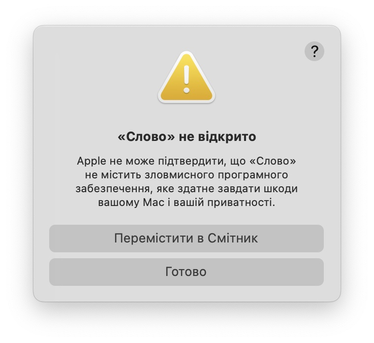
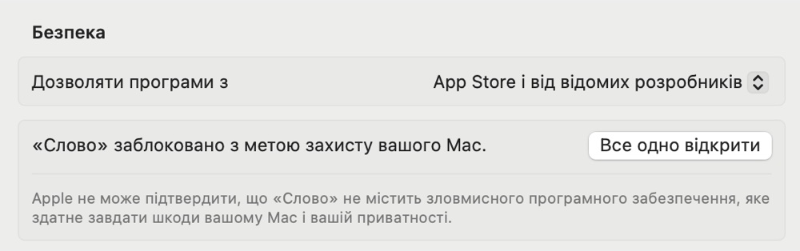
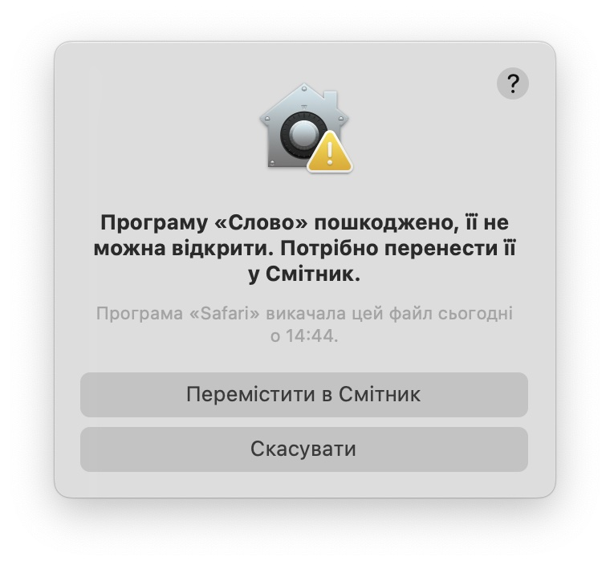
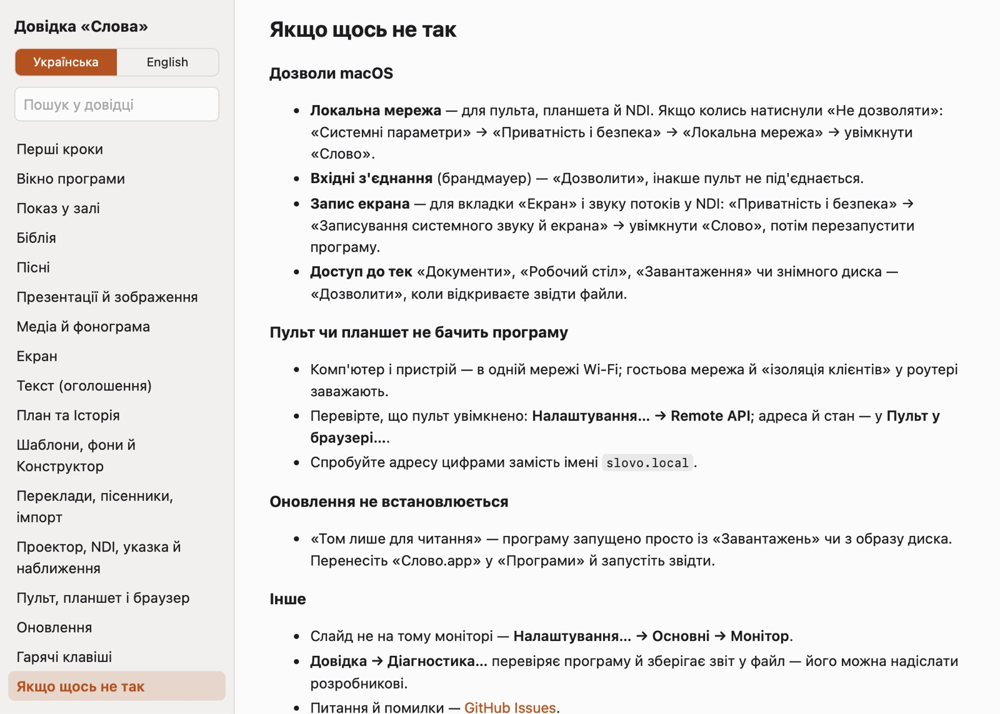
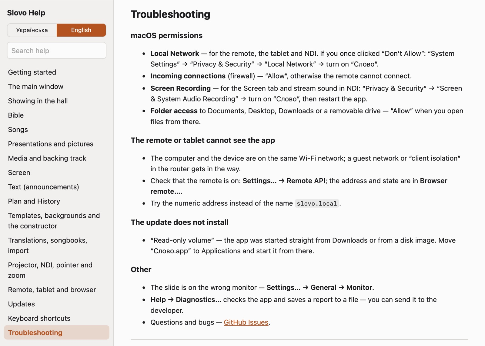

# Як запустити «Слово» на Mac

[Українська](#як-запустити-слово-на-mac) · [English](#english)

«Слово» не продається в App Store і не підписане сертифікатом розробника
Apple, тому на першому запуску macOS його блокує: система не знає автора і
не може перевірити програму на своїх серверах. Це очікувано — нижче покроково,
як відкрити програму, що робити з кожною помилкою і які дозволи вона
попросить.

## 1. Завантажити й покласти в «Програми»

1. Завантажте `Slovo-<версія>-macOS.zip` з
   [Releases](https://github.com/roman885-85/slovo/releases/latest).
2. Розпакуйте архів подвійним клацанням (вбудованою «Утилітою архівів»).
3. **Перенесіть «Слово.app» у теку «Програми»** (Applications).

Чому саме «Програми»: програму, запущену просто із «Завантажень» чи з
образу диска, macOS відкриває з тимчасової копії лише для читання (App
Translocation). Працювати вона буде, але оновлення не зможе замінити файли —
див. [помилку 4.5](#45-оновлення-том-лише-для-читання).

## 2. Перший запуск

### macOS 15 Sequoia і новіші

1. Відкрийте «Слово» подвійним клацанням. З'явиться вікно **«Слово» не
   відкрито** з текстом «Apple не може підтвердити, що «Слово» не містить
   зловмисного програмного забезпечення…». Натисніть **«Готово»** (не
   «Перемістити в Смітник»).

   

2. Відкрийте **«Системні параметри» → «Приватність і безпека»** і прокрутіть
   униз до розділу «Безпека».
3. Там буде рядок про те, що «Слово» заблоковано. Натисніть **«Все одно
   відкрити»** і підтвердіть паролем або Touch ID.

   

4. У наступному вікні ще раз **«Все одно відкрити»**.

Далі програма відкривається звичайно, без питань.

### macOS 11–14 (Big Sur, Monterey, Ventura, Sonoma)

1. У Finder клацніть «Слово.app» **правою кнопкою** (або з Control) →
   **«Відкрити»**.
2. У вікні «Програма «Слово» походить від невідомого розробника. Справді
   відкрити її?» натисніть **«Відкрити»**.

Якщо кнопки «Відкрити» у вікні немає — закрийте його й зробіть як для
macOS 15: «Системні параметри» → «Захист і безпека» (на macOS 13–14 —
«Приватність і безпека») → «Все одно відкрити».

Офіційно від Apple:
[Відкриття програми від невстановленого розробника](https://support.apple.com/uk-ua/guide/mac-help/mh40616/mac).

## 3. Дозволи, які програма просить

«Слово» просить дозвіл лише тоді, коли він справді потрібен. Якщо колись
натиснули «Не дозволяти» — усе вмикається потім у «Системні параметри» →
«Приватність і безпека».

| Запит macOS | Навіщо | Що натиснути | Де ввімкнути пізніше |
| --- | --- | --- | --- |
| **Знаходити пристрої в локальній мережі** (macOS 15+) | пульт на телефоні, планшет, пульт у браузері, NDI | «Дозволити» | «Приватність і безпека» → «Локальна мережа» → «Слово» |
| **Приймати вхідні мережні з'єднання** (лише коли ввімкнено брандмауер) | щоб пульт і планшет могли під'єднатися | «Дозволити» | «Мережа» → «Брандмауер» → «Параметри…» → «Слово» — «Дозволити вхідні з'єднання» |
| **Записування системного звуку й екрана** | вкладка «Екран» (монітор чи вікно іншої програми в залі) і звук потоків та YouTube у NDI | «Відкрити Системні параметри», увімкнути «Слово», **перезапустити програму** | «Приватність і безпека» → «Записування системного звуку й екрана» |
| **Доступ до тек** «Документи», «Робочий стіл», «Завантаження», знімних і мережевих дисків | коли відкриваєте звідти презентації, картинки, відео, модулі | «Дозволити» | «Приватність і безпека» → «Файли та папки» → «Слово» |

На macOS 15 система час від часу нагадує, що програма має доступ до екрана,
і пропонує «Дозволити на місяць» — це звичайне нагадування, дозвіл можна
продовжити.

Мікрофон, камера, контакти, «Універсальний доступ» програмі не потрібні.

## 4. Помилки й що з ними робити

### 4.1. «Слово» не відкрито, «походить від невідомого розробника»

Звичайне блокування першого запуску — зробіть як у [розділі 2](#2-перший-запуск).

### 4.2. «Програму «Слово» пошкоджено, її не можна відкрити»



Натисніть **«Скасувати»**, не «Перемістити в Смітник». Програма ціла: так macOS
реагує на позначку «завантажено з інтернету» (карантин), особливо коли архів передавали через месенджер або розпаковували
сторонньою програмою. Зніміть позначку в Терміналі:

```sh
xattr -dr com.apple.quarantine "/Applications/Слово.app"
```

і відкрийте програму знову. Якщо «Слово.app» лежить не в «Програмах», замініть
шлях (можна перетягнути програму у вікно Термінала після `xattr -dr
com.apple.quarantine `).

### 4.3. У «Приватність і безпека» немає кнопки «Все одно відкрити»

- Кнопка з'являється лише **після спроби відкрити** програму й тримається
  приблизно годину. Спробуйте відкрити «Слово» ще раз і одразу перейдіть у
  параметри.
- На службовому Mac, яким керує організація (MDM), запуск програм не з App
  Store може бути заборонено — зверніться до адміністратора або скористайтеся
  командою з [4.2](#42-програму-слово-пошкоджено-її-не-можна-відкрити).

### 4.4. «Вам потрібна новіша версія macOS» / програма не запускається на старому Mac

«Слову» потрібна **macOS 11 Big Sur або новіша** (Intel чи Apple Silicon).
На macOS 10.15 і старших програма не відкривається.

### 4.5. Оновлення: «том лише для читання»

Програму запущено із «Завантажень», з образу диска чи просто з архіву, і
macOS відкрила її з тимчасової копії. Закрийте «Слово», перенесіть
«Слово.app» у «Програми», запустіть звідти й оновіть ще раз. Переклади,
пісенники й налаштування нікуди не зникають.

### 4.6. «У вас немає привілеїв на запуск програми «Слово»», «пошкоджена або неповна», програма одразу закривається

- Архів розпаковано програмою, що загубила права на запуск. Розпакуйте його
  ще раз вбудованою «Утилітою архівів» або виконайте:

  ```sh
  chmod +x "/Applications/Слово.app/Contents/MacOS/Slovo"
  ```

- Якщо програма й далі закривається — відкрийте її ще раз і скористайтеся
  **«Довідка» → «Діагностика…»**, або надішліть опис у
  [Issues](https://github.com/roman885-85/slovo/issues).

### 4.7. Пульт чи планшет не бачить програму

- Комп'ютер і телефон — у **тій самій мережі Wi-Fi**; гостьова мережа й
  «ізоляція клієнтів» у роутері заважають.
- Дозвіл **«Локальна мережа»** для «Слова» ввімкнено (див. [розділ 3](#3-дозволи-які-програма-просить)).
- Якщо ввімкнено брандмауер — «Слову» дозволено вхідні з'єднання.
- У «Слові»: **«Налаштування» → «Пульт у браузері…»** показує адресу й стан;
  спробуйте адресу цифрами замість `slovo.local`.

### 4.8. Вкладка «Екран» показує порожній список або чорний кадр

Не дано дозвіл **«Записування системного звуку й екрана»** або програму не
перезапустили після того, як його дали. Увімкніть «Слово» в «Приватність і
безпека» → «Записування системного звуку й екрана», закрийте «Слово» повністю
(⌘Q) і відкрийте знову.

## 5. Довідка в самій програмі

Меню **«Довідка»** відкриває довідку українською й англійською без
інтернету: як працювати з кожною вкладкою, гарячі клавіші й розділ «Якщо щось
не так».



---

# English

Slovo is not sold in the App Store and is not signed with an Apple Developer
certificate, so macOS blocks it on the first launch: the system does not know
the developer and cannot check the app on its servers. This is expected —
below are the steps to open the app, what to do about each error and which
permissions it asks for.

## 1. Download and put it in Applications

1. Download `Slovo-<version>-macOS.zip` from
   [Releases](https://github.com/roman885-85/slovo/releases/latest).
2. Unzip it with a double click (the built-in Archive Utility).
3. **Move “Слово.app” to the Applications folder.**

Why Applications: an app started straight from Downloads or a disk image is
run by macOS from a temporary read-only copy (App Translocation). It works,
but an update cannot replace its files — see [error 4.5](#45-update-read-only-volume).

## 2. First launch

### macOS 15 Sequoia and later

1. Double-click “Слово”. A window **“Слово” Not Opened** appears: “Apple could
   not verify “Слово” is free of malware that may harm your Mac or compromise
   your privacy.” Click **Done** (not “Move to Trash”).

   

2. Open **System Settings → Privacy & Security** and scroll down to the
   Security section.
3. There is a line saying “Слово” was blocked. Click **Open Anyway** and
   confirm with your password or Touch ID.

   

4. In the next window click **Open Anyway** again.

From then on the app opens normally.

### macOS 11–14 (Big Sur, Monterey, Ventura, Sonoma)

1. In Finder, **right-click** (or Control-click) “Слово.app” → **Open**.
2. In the window ““Слово” is from an unidentified developer. Are you sure you
   want to open it?” click **Open**.

If the window has no Open button, close it and do as on macOS 15: System
Settings → Security & Privacy → Open Anyway.

Apple’s official guide:
[Open a Mac app from an unknown developer](https://support.apple.com/guide/mac-help/mh40616/mac).

## 3. Permissions the app asks for

Slovo asks for a permission only when it is really needed. If you once
clicked “Don’t Allow”, everything can be turned on later in System Settings →
Privacy & Security.

| macOS prompt | What for | What to click | Where to turn it on later |
| --- | --- | --- | --- |
| **Find devices on local networks** (macOS 15+) | phone remote, tablet, browser remote, NDI | Allow | Privacy & Security → Local Network → Слово |
| **Accept incoming network connections** (only with the firewall on) | so the remote and the tablet can connect | Allow | Network → Firewall → Options… → Слово — Allow incoming connections |
| **Screen & System Audio Recording** | the Screen tab (a monitor or another app’s window in the hall) and stream/YouTube sound in NDI | Open System Settings, turn on Слово, **restart the app** | Privacy & Security → Screen & System Audio Recording |
| **Access to folders** Documents, Desktop, Downloads, removable and network drives | when you open presentations, pictures, video or modules from there | Allow | Privacy & Security → Files & Folders → Слово |

On macOS 15 the system reminds you from time to time that the app can access
the screen and offers “Allow For One Month” — this is a normal reminder.

The app does not need the microphone, camera, contacts or Accessibility.

## 4. Errors and what to do

### 4.1. “Слово” Not Opened, “from an unidentified developer”

The normal first-launch block — follow [section 2](#2-first-launch).

### 4.2. “Слово” is damaged and can’t be opened

The full message is ““Слово” is damaged and can’t be opened. You should move
it to the Trash.”


Click **Cancel**, not “Move to Trash”. The app is fine: this is how macOS reacts to the “downloaded from the
internet” flag (quarantine), especially when the archive came through a
messenger or was unzipped by a third-party tool. Remove the flag in Terminal:

```sh
xattr -dr com.apple.quarantine "/Applications/Слово.app"
```

and open the app again. If “Слово.app” is not in Applications, change the path
(you can drag the app into the Terminal window after `xattr -dr
com.apple.quarantine `).

### 4.3. No “Open Anyway” button in Privacy & Security

- The button appears only **after an attempt to open** the app and stays for
  about an hour. Try to open Slovo again and go to the settings right away.
- On a work Mac managed by an organization (MDM), apps outside the App Store
  may be forbidden — ask the administrator or use the command from
  [4.2](#42-слово-is-damaged-and-cant-be-opened).

### 4.4. “You need a newer version of macOS” / the app does not start on an old Mac

Slovo needs **macOS 11 Big Sur or later** (Intel or Apple Silicon). It does
not open on macOS 10.15 or earlier.

### 4.5. Update: “read-only volume”

The app was started from Downloads, a disk image or straight from the
archive, and macOS ran it from a temporary copy. Quit Slovo, move
“Слово.app” to Applications, start it from there and update again.
Translations, songbooks and settings stay.

### 4.6. “You do not have permission to open the application “Слово””, “may be damaged or incomplete”, the app quits at once

- The archive was unzipped by a tool that lost the execute permission. Unzip
  it again with the built-in Archive Utility or run:

  ```sh
  chmod +x "/Applications/Слово.app/Contents/MacOS/Slovo"
  ```

- If the app still quits, open it again and use **Help → Diagnostics…**, or
  describe the problem in [Issues](https://github.com/roman885-85/slovo/issues).

### 4.7. The remote or tablet cannot see the app

- The computer and the phone are on **the same Wi-Fi network**; a guest
  network or “client isolation” in the router gets in the way.
- The **Local Network** permission is on for Slovo (see [section 3](#3-permissions-the-app-asks-for)).
- With the firewall on, Slovo is allowed incoming connections.
- In Slovo: **Setup → Browser remote…** shows the address and state; try the
  numeric address instead of `slovo.local`.

### 4.8. The Screen tab shows an empty list or a black frame

The **Screen & System Audio Recording** permission is not given, or the app
was not restarted after it was given. Turn on Slovo in Privacy & Security →
Screen & System Audio Recording, quit Slovo completely (⌘Q) and open it again.

## 5. Help inside the app

The **Help** menu opens help in Ukrainian and English without the internet:
how to work with every tab, keyboard shortcuts and a Troubleshooting section.


